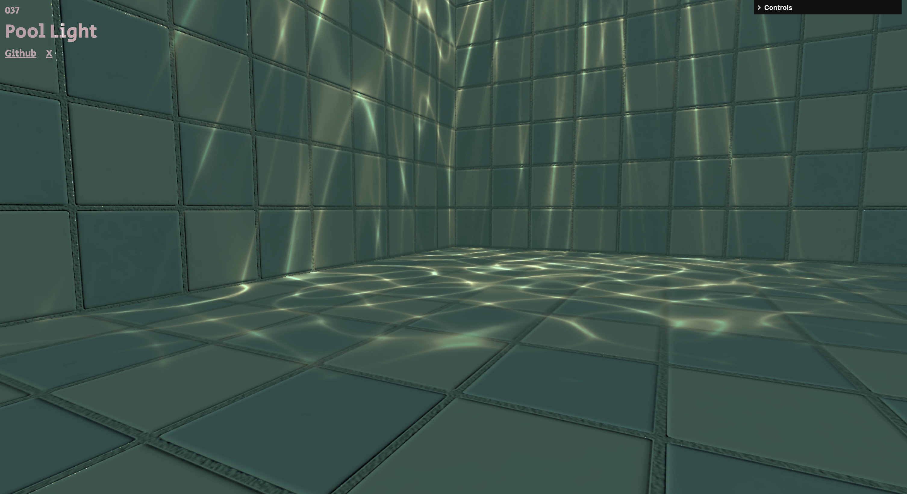

# webgl-works-37 Pool Light



[https://taic-dev.github.io/webgl-works-37](https://taic-dev.github.io/webgl-works-37)

## Features

- **Three.js**: Build stunning 3D applications.
- **TypeScript**: Write maintainable and type-safe code.
- **Vite**: Enjoy blazing-fast development and build tools.
- **GLSL Support**: Write and bundle shader code seamlessly using `vite-plugin-glslify`.

## Getting Started

1. Clone the repository:
  ```bash
  git clone git@github.com:taic-dev/webgl-works-37.git

  cd webgl-works-37
  ```
2. Install dependencies:
  ```
  npm install
  ```

### Development

To start the development server:
```bash
npm run dev
```
The application will be available at http://localhost:5173.

### Build

To build the project for production:

```bash
npm run build
```
The output files will be available in the dist directory.

### Preview
To preview the production build:
```bash
npm run preview
```

### Dependencies
- three: Core 3D rendering library.
- gsap: Animation library for smooth transitions and effects.
- vite-plugin-glslify: GLSL shader support in Vite.
- vite-plugin-gltf: Simplified GLTF model loading.

### Dev Dependencies
- @types/three: TypeScript definitions for Three.js.
- typescript: TypeScript compiler.
- vite: Frontend development and build tool.

### Contributing
Contributions are welcome! Please follow these steps:

1. Fork the repository.
2. Create a new branch: git checkout -b feature-name.
3. Commit your changes: git commit -m 'Add feature'.
4. Push to the branch: git push origin feature-name.
5. Create a pull request.

### License
This project is licensed under the [MIT License](./LICENSE).

### Contributing

Feel free to open issues or submit pull requests to enhance this template. Contributions are welcome!